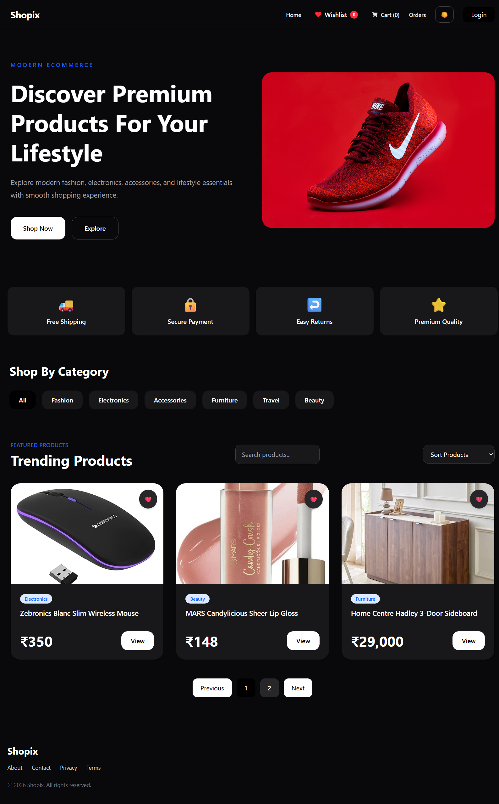
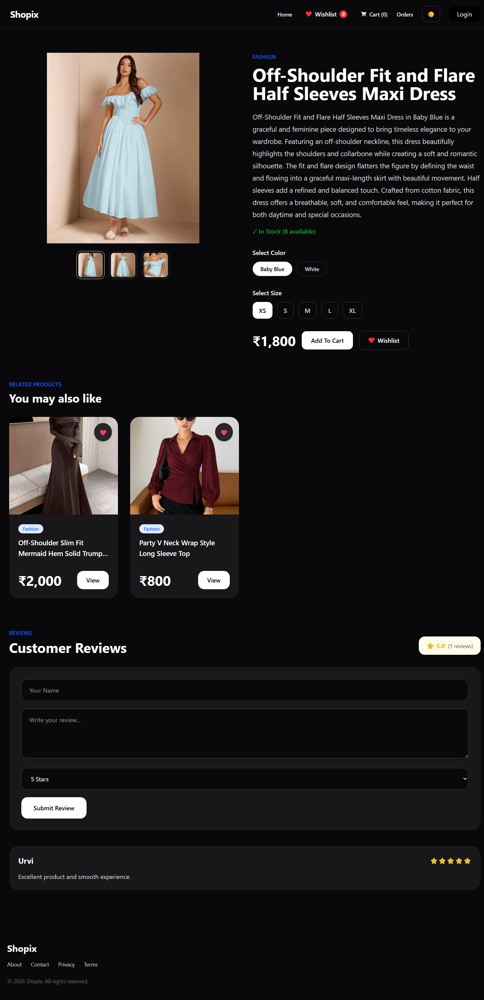
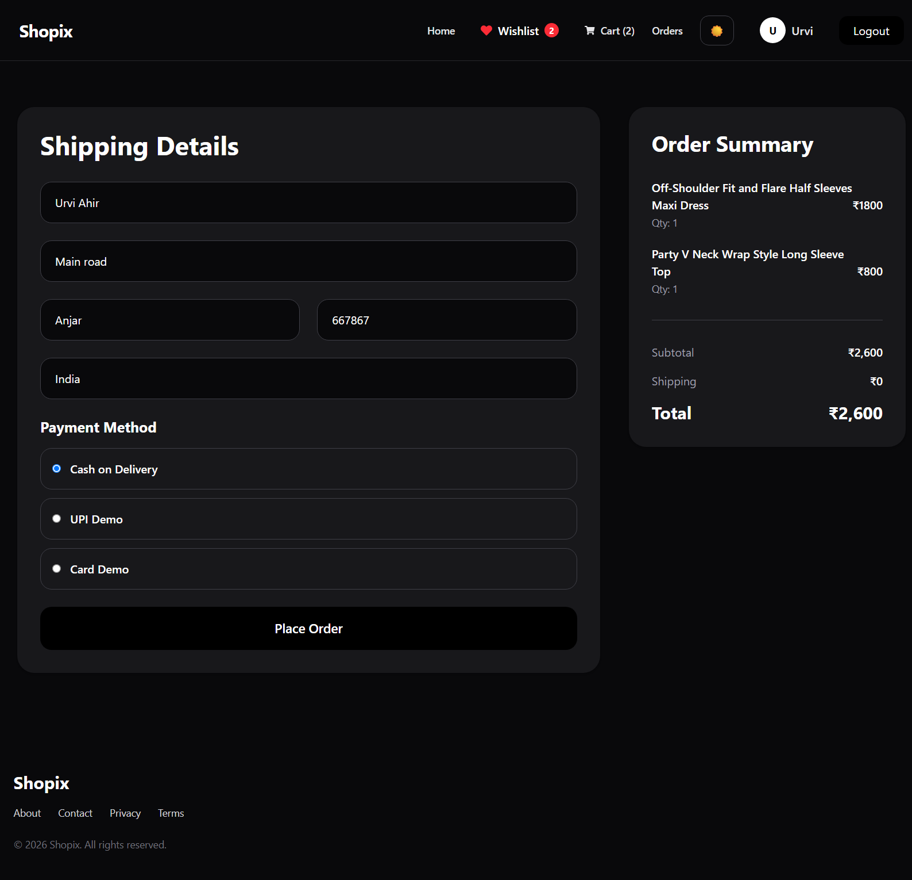
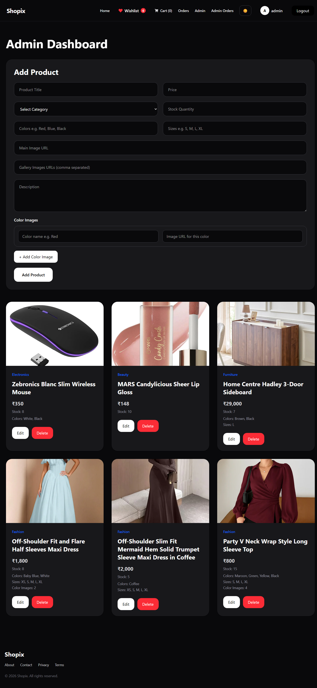

# 🛍️ Shopix - MERN E-Commerce Store

## 🚀 Project Overview

Shopix is a full-stack MERN E-Commerce application built using React, Redux Toolkit, Tailwind CSS, Node.js, Express.js, and MongoDB.

The platform provides a complete online shopping experience with authentication, product management, cart functionality, order processing, reviews, and an admin dashboard.

Users can browse products, manage their cart and wishlist, place orders, submit reviews, and manage their profiles. The application also includes an admin dashboard for managing products and orders.

---

## ✨ Features

### User Features

- User Registration & Login
- JWT Authentication
- Product Search & Sorting
- Product Details Page
- Product Image Gallery
- Color & Size Selection
- Wishlist Management
- Shopping Cart
- Checkout System
- Payment Method Selection
- Order History
- Product Reviews & Ratings
- User Profile Page
- Dark Mode
- Responsive Design

### Admin Features

- Admin Dashboard
- Create Products
- Edit Products
- Delete Products
- Manage Product Stock
- Manage Product Images
- View All Orders
- Update Order Status

---

## 🛠️ Tech Stack

### Frontend

- React.js
- Redux Toolkit
- React Router DOM
- Tailwind CSS
- Framer Motion
- Axios

### Backend

- Node.js
- Express.js
- MongoDB
- Mongoose
- JWT Authentication
- bcryptjs

### Deployment

- Vercel
- Render
- MongoDB Atlas

---

## 🖼️ Screenshots

### Home Page



### Product Details Page



### Checkout Page



### Admin Dashboard



---

## 🌐 Live Demo

### Frontend

https://shopix-psi.vercel.app

### Backend API

https://shopix-y74v.onrender.com

---

## 📂 GitHub Repository

https://github.com/urvijahir/shopix

---

## ⚙️ Installation

```bash
git clone https://github.com/urvijahir/shopix.git
cd shopix

# Frontend
cd client
npm install
npm run dev

# Backend
cd ../server
npm install
npm run server
```

---

## 🔑 Environment Variables

Create a `.env` file inside the `server` folder:

```env
MONGO_URI=your_mongodb_connection_string
JWT_SECRET=your_secret_key
```

---

## 🔮 Future Improvements

- Forgot Password System
- Razorpay Payment Integration
- Email Notifications
- Advanced Product Filters
- User Avatar Upload
- Sales Analytics Dashboard
